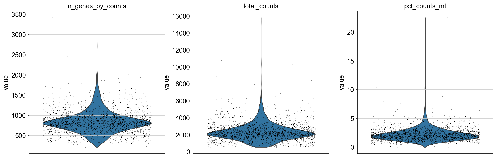
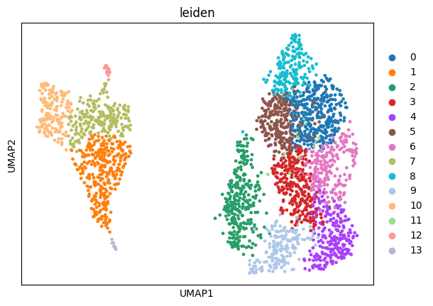

# scRNAseq_PBMC_Pipeline
A complete scRNA-seq preprocessing and clustering pipeline for PBMC 3k dataset using Scanpy and Leiden algorithm.

## 🔬 Project 02: PBMC 單細胞 RNA 定序分析管線

### 🎯 專案目標 (Project Goal)
本專案展示了從原始單細胞計數矩陣到細胞分群與視覺化的完整生物資訊管線 (Pipeline)，旨在識別 PBMC 樣本中的不同細胞類型。

### 🛠️ 使用技術 (Technologies Used)
* Python (3.x)
* Scanpy (生物資訊核心函式庫)
* Leidenalg (高性能分群演算法)
* UMAP (非線性降維) **— 註：全程設定 Random State 確保結果可重現。**

---

### 🔎 數據品質控制 (Quality Control & Preprocessing)

為了確保分析基礎的可靠性，我們首先計算並視覺化了關鍵的 QC 指標，並根據圖表結果決定過濾閾值：

**分析結論：**
* 根據基因數量 (`n_genes_by_counts`) 與粒線體比例 (`pct_counts_mt < 5%`) 進行過濾，移除了低品質和潛在的雙細胞 (Doublets)。

#### 資料清洗與過濾結果
- 原始數據：2700 個細胞, 32738 個基因
- **過濾後：** 2638 個高品質細胞, 13656 個基因
- **特徵選擇：** 1826 個高變異基因 (HVGs) 被選出用於降維分析。

---

### 📈 成果總覽 (Results & Visualization)

#### UMAP 細胞分群視覺化 (Leiden Clustering)

圖中清晰地將細胞分成了 **14 個群集 (0-13)**，這些群集在基因表現上高度相似，代表 PBMC 樣本內的多種細胞類型 (如 T-cells, B-cells, Monocytes)。

**重現性備註：** 為確保分群結果穩定，本專案在 UMAP 與 Leiden 演算法中統一設定了 **亂數種子 (Random State = 42)**。

---
### 💾 專案數據資產與可重現性 (Final Data Asset)

本專案的最終輸出檔案是經過清洗、標準化、降維和分群的 `AnnData` 物件：`pbmc_processed_for_ml.h5ad`。

由於該檔案體積較大 (約 60MB)，它已被託管在雲端，作為後續 **Project 03/04 機器學習分類器** 的輸入數據。

**下載連結：**
請前往 **`03/04_PBMC_TCell_Classifier`** 專案的 `README.md` 中，查看該檔案的具體雲端下載連結。
